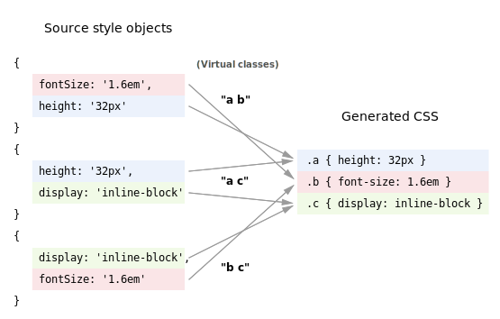
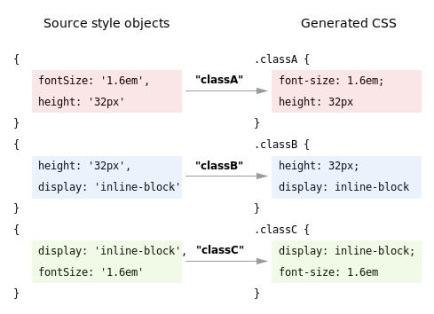

## Introducing [Styletron](https://github.com/rtsao/styletron)

Styletron is a CSS-in-JS library built from the ground up for high-performance, designed to work as fast as possible while also producing the smallest possible CSS output.

Most CSS-in-JS libraries convert JS objects containing style declarations into corresponding CSS classes with generated, hashed class names[^1]. In general, this process works well and solves most of the problems of CSS[^2].

[Styletron](https://github.com/rtsao/styletron) takes a different approach. Under the hood it uses a "virtual CSS" engine that abstracts away the underlying CSS, enabling some powerful performance optimizations.

### Atomic CSS and virtual classes

The key idea is that rather than generating CSS classes that simply map 1:1 to the source style objects, Styletron breaks down everything into unique declarations and creates a corresponding "atomic CSS" class for each unique property/value pair[^3]. As a result, instead of generating monolithic classes for styles, Styletron is able to generate corresponding virtual classes, composed of several constituent atomic classes.

This abstraction enables several performance advantages:

### Non-growing stylesheets

There's ultimately a finite number of different font sizes, widths, and colors in any given application. And in practice, for purposes of design consistency, the options are often intentionally restricted to a small set of shared values which are then repeated many times throughout the application.

Styletron is able to take advantage of this because its virtual CSS abstraction deduplicates styles on a declaration level, even across distinct rules. In a sense, CSS becomes *non-growing*: at a certain point, newly added styles are actually just new permutations of preexisting declarations, which map to preexisting atomic classes, yielding zero additional bytes of generated CSS. In other words, with virtual CSS, the size of the CSS output scales with the number of *unique declarations* rather than volume or quantity of styles used.

In practice, this can have a tremendous impact on size, especially on large-scale websites, where the total number of declarations can far outweigh the number of unique declarations.

### Minimal possible critical stylesheets

An important part of CSS optimization is separating critical from non-critical CSS and eliminating unused CSS, which is simply wasted effort by the browser to both download and parse. Like many other CSS-in-JS solutions, Styletron automatically eliminates any unused and non-critical CSS from its output, leaving only the critical CSS for any given server-rendered page.

That's normally as good as it gets, but Styletron further reduces the size of the critical stylesheet even after eliminating non-critical and unused CSS. While gzip generally does a good job of compressing stylesheets, with Styletron, all declarations are deduplicated even *before* gzip compression. As a result, there's less for the browser to both download *and parse*, the latter of which is unaffected by gzip.

Furthermore, because the stylesheets generated by Styletron are so small, they can be easily inlined into the page. This matters for page performance: to ensure fast load times on mobile devices, the [AMP spec](https://www.ampproject.org/) actually prohibits external CSS resources, enforcing the inlining of all CSS (with a maximum size of 50KB).

### Fast runtime speed

Styletron was designed for high performance, not only in terms of tiny CSS output but also execution time. Unlike many other CSS-in-JS libraries that produce scoped CSS, Styletron doesn't need to perform expensive hash computations; instead its generated classes are composed of shared, re-usable atomic classes with sequential identifiers[^4]. Furtheremore, because it operates on individual declarations rather than entire rules, Styletron is able to reduce cache misses and take advantage of extremely granular memoization to avoid unnecessary work.

## Benchmarks

The [css-in-js-perf-tests repo](https://github.com/hellofresh/css-in-js-perf-tests) has a number of benchmarks for the most popular CSS-in-JS libraries, including Aphrodite, Glamor, JSS, and Styletron. The numbers shown below are from running the benchmarks on my MacBook Pro on Node 7.

*Note: The JSS benchmarks below reflect usage without the default preset, so no extras such as nested rules or vendor prefixing are included.*

### Rendering performance

**Simple styles test**

This test renders a few [basic styles](https://github.com/hellofresh/css-in-js-perf-tests/blob/master/src/simple-test/styles.js), one for a container and one for a button.

**Styles overload test**

This test generates `n` unique styles for `n` different button elements, where `n=20` by default.

**Classes overload test**

This test generates `n` *identical* styles for `n` different button elements, again with `n=20` by default.

Unlike the other libraries, Styletron breaks down the rules and is thus able to memoize the identical declarations, so the performance advantage is especially apparent in this test.

### CSS output size

As an analogue for a large CSS-in-JS app, I took the CSS from [uber.com](https://www.uber.com) and [airbnb.com](https://www.airbnb.com), [converted](https://github.com/rtsao/styletron/blob/master/packages/benchmarks/generate-styles.js) the styles into JS object equivalents, and ran them through Styletron, JSS, Glamor, and Aphrodite. Below are file sizes of the resulting CSS output:

**uber.com CSS** - [Raw file](https://raw.githubusercontent.com/rtsao/styletron/master/packages/benchmarks/fixtures/css/uber.css)

**airbnb.com CSS** - [Raw file](https://raw.githubusercontent.com/rtsao/styletron/master/packages/benchmarks/fixtures/css/airbnb.css)

In general, the more re-used styles there are, the smaller the resulting CSS is with Styletron (in comparison to other libraries) as more CSS gets deduplicated.

### JS bundle size (minified)

Styletron is also the smallest of the bunch. It was designed to be as minimal as possible and has separate packages for client and server, which helps reduce bloat.

## Usage

The actual core Styletron module is extremely low-level, which makes it highly adaptable to many different CSS-in-JS interfaces but is rather unwieldy to use directly.

The simplest way to use Styletron is in conjunction with the styletron-utils package, which contains various convenience functions, including `injectStyle` which takes a style object and returns a corresponding virtual class name. This API roughly equivalent to what other CSS-in-JS libraries provide.

And finally, at the highest level, there's the styletron-react package which contains an interface inspired by the excellent [styled-components](https://github.com/styled-components/styled-components) module for React.

Check out the [GitHub repo](https://github.com/rtsao/styletron) and [styletron.js.org](http://styletron.js.org) to learn more.

## Known issues and trade-offs

**Descendant and child combinators are unsupported**

While the use of these is generally not needed when using React (where styles are co-located with templates and rendering logic), they can nonetheless be useful in certain cases[^5]. That said, for technical reasons these will probably not be supported in Styletron, at least in the near-term. Fortunately, anything descendant and child combinators can achieve in CSS can be replicated with rendering logic/JavaScript.

**No value fallbacks, yet**

[This is being worked on](https://github.com/rtsao/styletron/issues/6), but is currently not implemented.

**Workflow impact with DevTools**

As a result of the virtual classes, when inspecting elements you will see a class for each declaration in the styles pane, which can be cumbersome at times. Additionally, with Chrome DevTools, client-rendered atomic classes are immutable -- they can be toggled on and off elements, but not altered due to a Chromium bug[^6]. Server-rendered styles are unaffected, and this bug only affects Chrome (Safari and Firefox work fine).

## Footnotes

[^1]: Most CSS-in-JS libraries, including Aphrodite, Glamor, and JSS, etc. use the following approach:

    

    The method of scoping the class names varies, but it's a 1:1 mapping between collections of declarations to generated CSS classes.

[^2]: Christopher Chedeau's [seminal presentation on CSS-in-JS](http://blog.vjeux.com/2014/javascript/react-css-in-js-nationjs.html) provides a good overview of the flaws of CSS and how styles in JavaScript can be a solution.

[^3]: This is conceptually similar to the [react-native-web](https://github.com/necolas/react-native-web) StyleSheets module (which actually pioneered the idea generating atomic CSS for server-rendered pages), but Styletron takes it further in a few key ways:

    1. Styletron works for all styles -- both static and dynamic. react-native-web StyleSheets are limited to static styles that can be resolved outside of render.

    2. react-native-web StyleSheets only works server-side; on the client, vanilla React inline styles are used.

    3. react-native-web lacks support for media queries and pseudo classes, Styletron supports both.

[^4]: One reason for using deterministic hashing is for consistency between server and client renders. Because Styletron CSS output consists of only single-declaration atomic classes, it is essentially a full serialization of the declaration cache from the server. As a result, the server-rendered CSS can be efficiently deserialized to fully hydrate the declaration cache state on the client.

[^5]: The one area where this is useful is combining descendant combinators with pseudo classes, the most common use case being where hovering a parent triggers a style change in a descendant node. However, this behavior be implemented in JavaScript with event listeners and explicit state changes if needed.

[^6]: Unfortunately, [this bug is currently marked as wontfix](https://bugs.chromium.org/p/chromium/issues/detail?id=387952).
